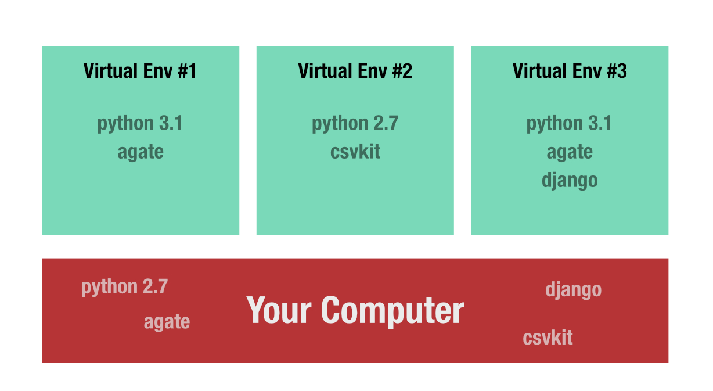

# Getting Started
We're going to start by installing some important things on your computers. These will be useful in all the coding things you'll do in the future.

## Virtual Environments
In order to download things (languages, libraries, etc) on your computer, you'll want to set up a virtual environment system.

A virtual environment allows you to install different versions of things on your computer so you can avoid permissions and agreement issues. Permissions issues come about when you are logged in as a user that does not have sufficient permissions to download languages, libraries or modules. Agreement issues come about when you install the wrong versions of certain languages, libraries or modules so things that should work seamlessly with each other throw error messages and will not function.

The virtual environment system I use is called Virtual Environment Wrapper, or virtualenvwrapper. 

### Resources

If you're working with MAC, [here's how you install it](http://virtualenvwrapper.readthedocs.io/en/latest/install.html).

If you're working with a PC, [here's how you install it](http://timmyreilly.azurewebsites.net/python-pip-virtualenv-installation-on-windows/).

## Python
The first language we're going to tackle is python. Python is probably one of the most human-readable languages out there, and it's a favorite in the journalism community. There are a lot of great python-based tools out there that can help you process (sort, filter, refine, clean, etc.) data.

### What I use to work with data

- [agate](http://agate.readthedocs.io/en/1.6.0/about.html): used mostly in scripts
- [csvkit](https://csvkit.readthedocs.io/en/1.0.2/): used mostly on the command line
- [django](https://docs.djangoproject.com/en/1.11/): used when you've got a relational database. We probably won't be getting into this for a long while, but it's good to know it's something that exists.

### Resources

Until you get your computer up-and-running with your virtual environment, you can start learning python in the cloud with this handy, [Code Acadamy walk through](https://www.codecademy.com/learn/learn-python). If you create an account with Code Academy, you can save your progress and come pack to the tutorial where you left off. I recommend this.

There is also a [Code Academy tutorial on the command line](https://www.codecademy.com/learn/learn-the-command-line). If you're unfamiliar the command line, I suggest also doing that one.

## Command Line vs Scripting
There are two major ways to write and execute code on your computer. Both involve an application on your computer called The Terminal.