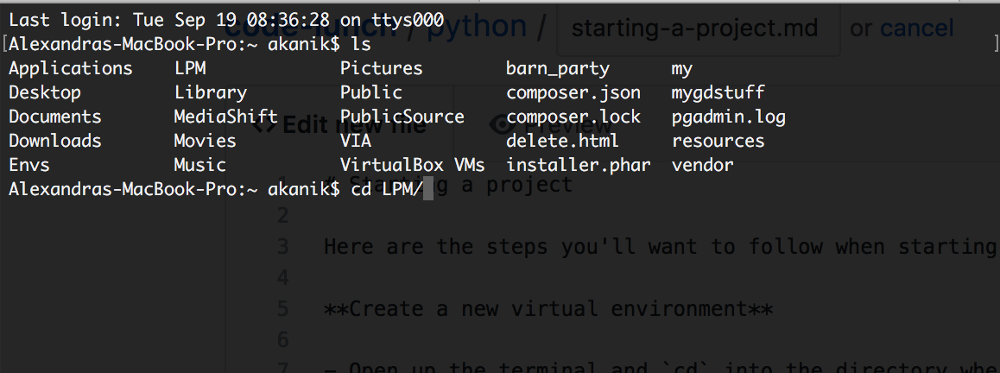
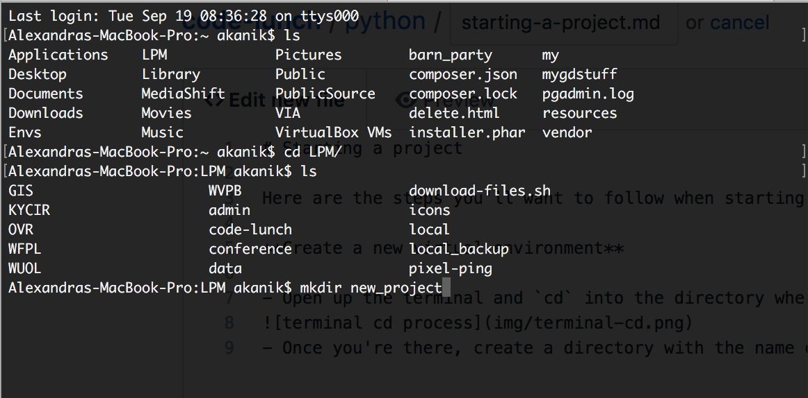
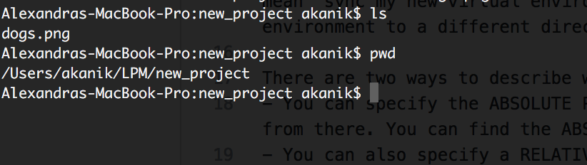

# Starting a project

Here are the steps you'll want to follow when starting a new project that will require python.

## Create a new virtual environment

- Open up the terminal and `cd` into the directory where your new project is going to live.

- Once you're there, use `mkdir` to create a directory with the name of your project

- `cd` into your newly created project directory
- Create your virtual environment and link it to your project directory with `mkvirtualenv [environment-name] -a ./`
-- `mkvirtualenv` is how we start the environment creation process
-- `[environment-name]` is the name of our environment. This can be anything you want, but I like to keep it similar if not the same as my project name
-- `-a` is a "parameter" of the `mkvirtualenv` function. It tells the virtual environment program which directory we want our virtual environment to sync to. `./` is the path of the directory that `-a` is talking about. So together, these two elements mean "sync my new virtual environment to the directory I'm currently standing in." If we wanted to sync our new virtual environment to a different directory, we could either supply a ABSOLUTE PATH or a RELATIVE PATH instead of the `./`.
- Creating the virtual environment will automatically start the environment. You should see parentheses around your environment name before the normal terminal line start.

## Create a python file

We've created a virtual environment because we're running some code, right? So let's create a code doc!

In the terminal, if your not already in your virtual environment, spin that up. It should automatically take you to your project folder.

Once you're in there, type `touch analyze.py`. Hooray! We've just created our first python document.

We can now open that document with the text editor of our choice.

## Create a data folder

I like to keep the data I'll be analyzing in its own, self-contained directory. Let's make a directory for the data we'll be downloading. Get into your project directory and type `mkdir data`. 

If you type `ls` in the terminal you should now see two things pop up. 
- `analyze.py` and 
- `data`

Now we're cooking with gas!

--------

## Understanding path declarations

There are two ways to describe where files you're trying to reference live on your computer:
- You can specify the ABSOLUTE PATH of the file, which tells the computer to start from the root of your computer and work from there. You can find the ABSOLUTE PATH by entering this command into the terminal `pwd`.
- You can also specify a RELATIVE PATH of the file, which tells the computer to start from where you currently are and work from there.

So, if you `cd` into a directory that looks like this:

- The ABSOLUTE PATH to the file `dogs.png` is `/Users/akanik/LPM/new_project/dogs.png`
- The RELATIVE PATH to the file `dogs.png` is `./dogs.png`
